# Java Backend Learning Journey

<p align="center">
  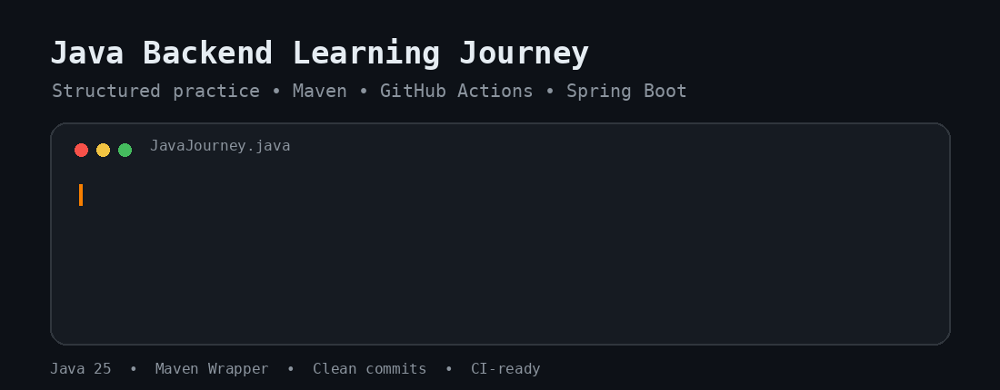
</p>

<p align="center">
  <a href="https://github.com/himanshuParashar0101/java-backend-learning-journey/actions/workflows/maven-ci.yml">
    
  </a>
  
  
  
</p>

A structured learning repository documenting my progression from **Java fundamentals** to **professional backend engineering** with Java, Maven, Spring Boot, databases, testing, and production-oriented development practices.

## Quick Navigation

- [Current Focus](#current-focus)
- [Learning Progress](#learning-progress)
- [Repository Structure](#repository-structure)
- [Development Workflow](#development-workflow)
- [Build and Verification](#build-and-verification)
- [Continuous Integration](#continuous-integration)
- [Developer Fun Corner](#developer-fun-corner)
- [More Developer Moments](#more-developer-moments)
- [Documentation](#documentation)

## Current Focus

## Current Focus

**Java decision-making fundamentals completed**

- Boolean expressions
- Comparison operators
- Logical operators
- `if`, `else-if`, and `else`
- Boundary-condition testing
- Conditional practice problems

**Next milestone:** Java loops

<p align="center">
  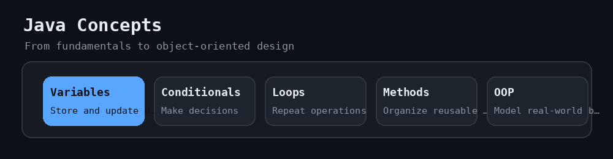
</p>

## Learning Progress

<p align="center">
  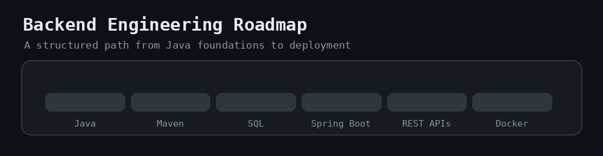
</p>

### Java Fundamentals

- [x] Java development environment setup
- [x] First Java program
- [x] Variables and data types
- [x] Arithmetic operators
- [x] Conditional statements
- [ ] Loops
- [ ] Methods
- [ ] Arrays
- [ ] Strings
- [ ] User input

### Core Java

- [ ] Object-oriented programming
- [ ] Collections and generics
- [ ] Exception handling
- [ ] File handling
- [ ] Streams and functional programming
- [ ] Multithreading and concurrency
- [ ] JVM fundamentals
- [ ] Unit testing

### Backend Development

- [ ] SQL
- [ ] JDBC
- [ ] Spring Framework
- [ ] Spring Boot
- [ ] REST API development
- [ ] Spring Data JPA
- [ ] Hibernate
- [ ] Validation
- [ ] Spring Security
- [ ] Docker
- [ ] CI/CD
- [ ] Microservices
- [ ] System design

## Repository Structure

```text
java-backend-learning-journey/
├── .github/
│   └── workflows/
│       └── maven-ci.yml
├── .mvn/
│   └── wrapper/
│       └── maven-wrapper.properties
├── docs/
│   └── assets/
│       ├── java-backend-readme-banner.gif
│       ├── java-concepts.gif
│       ├── backend-roadmap.gif
│       ├── git-workflow.gif
│       ├── commit-history.gif
│       ├── maven-build.gif
│       ├── fun/
│       └── extra/
├── src/
│   ├── main/
│   │   ├── java/
│   │   │   └── com/
│   │   │       └── himanshu/
│   │   │           └── javajourney/
│   │   │               ├── fundamentals/
│   │   │               │   ├── setup/
│   │   │               │   ├── introduction/
│   │   │               │   ├── variables/
│   │   │               │   ├── operators/
│   │   │               │   │   ├── basics/
│   │   │               │   │   └── problems/
│   │   │               │   └── conditionals/
│   │   │               │       ├── basics/
│   │   │               │       └── problems/
│   │   │               └── sandbox/
│   │   └── resources/
│   └── test/
│       ├── java/
│       └── resources/
├── .gitattributes
├── .gitignore
├── LEARNING_LOG.md
├── ROADMAP.md
├── mvnw
├── mvnw.cmd
├── pom.xml
└── README.md
```

## Development Workflow

Every learning topic follows an industry-style Git and GitHub workflow:

1. Create a GitHub issue
2. Create a short-lived working branch
3. Make focused commits
4. Push the branch to GitHub
5. Open a pull request
6. Review the changed files
7. Run automated Maven checks
8. Merge into `main`
9. Delete the completed branch

<p align="center">
  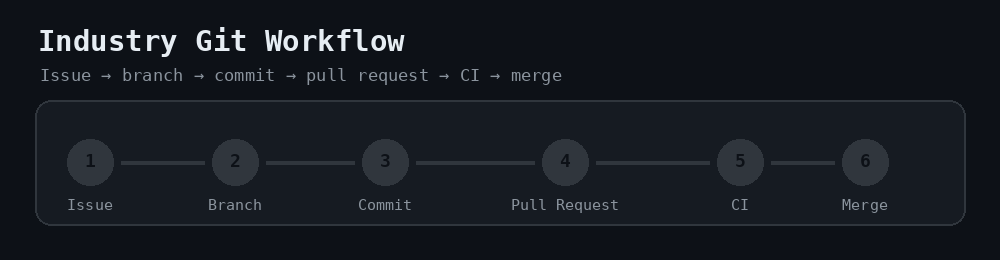
</p>

### Branch Naming Examples

```text
learn/2-conditionals
learn/3-loops
feature/10-add-user-registration
fix/15-handle-invalid-input
docs/20-update-roadmap
chore/1-repository-foundation
```

### Commit Message Examples

```text
feat(conditionals): add basic if statement example
test(conditionals): add eligibility checker tests
docs: update Java learning roadmap
build: add Maven Wrapper for reproducible builds
ci: verify project using Maven Wrapper
```

<p align="center">
  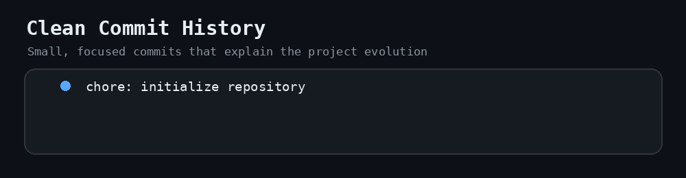
</p>

## Build and Verification

This project uses the **Maven Wrapper**, so a separate global Maven installation is not required.

<p align="center">
  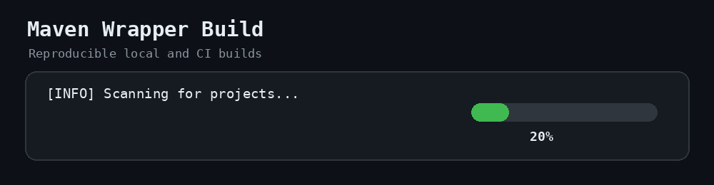
</p>

### Windows

```powershell
.\mvnw.cmd clean verify
```

### Linux and macOS

```bash
./mvnw clean verify
```

A successful build ends with:

```text
BUILD SUCCESS
```

## Continuous Integration

GitHub Actions automatically runs the Maven verification workflow when:

- A pull request targets `main`
- Changes are pushed to `main`
- The workflow is started manually from the Actions tab

Workflow file:

```text
.github/workflows/maven-ci.yml
```

## Engineering Principles

This repository follows these practices:

- Standard Maven project structure
- Clear package and class naming
- Short-lived branches
- Pull-request-based development
- Focused commit history
- Automated build verification
- Generated files excluded through `.gitignore`
- Reproducible builds through Maven Wrapper
- Consistent line endings through `.gitattributes`

## Developer Fun Corner

<table>
  <tr>
    <td align="center">
      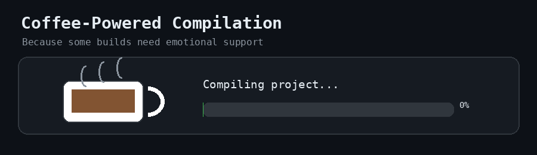
      <br />
      <strong>Coffee-Powered Compilation</strong>
    </td>
    <td align="center">
      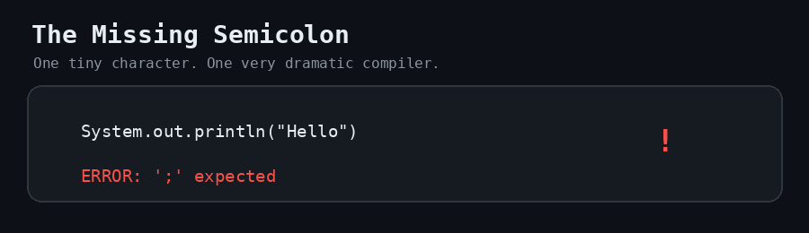
      <br />
      <strong>The Missing Semicolon</strong>
    </td>
  </tr>
  <tr>
    <td align="center">
      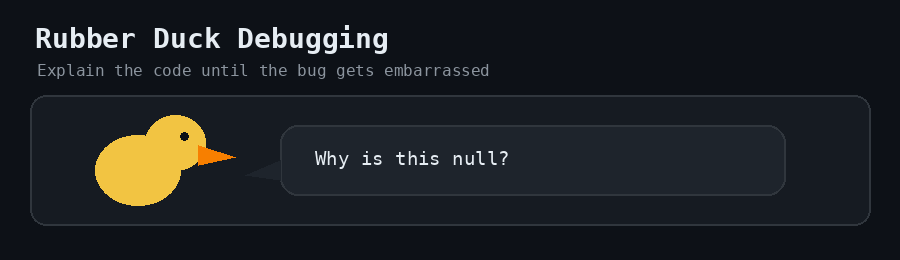
      <br />
      <strong>Rubber Duck Debugging</strong>
    </td>
    <td align="center">
      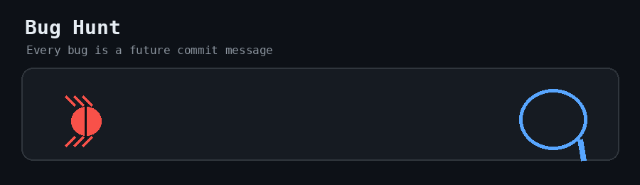
      <br />
      <strong>Bug Hunt</strong>
    </td>
  </tr>
  <tr>
    <td align="center">
      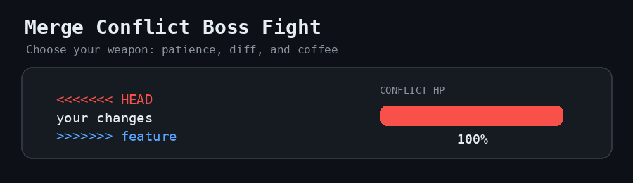
      <br />
      <strong>Merge Conflict Boss Fight</strong>
    </td>
    <td align="center">
      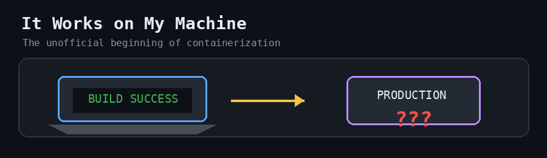
      <br />
      <strong>It Works on My Machine</strong>
    </td>
  </tr>
  <tr>
    <td align="center">
      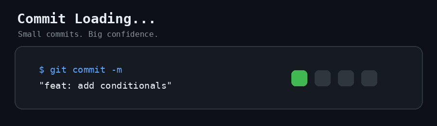
      <br />
      <strong>Commit Loading</strong>
    </td>
    <td align="center">
      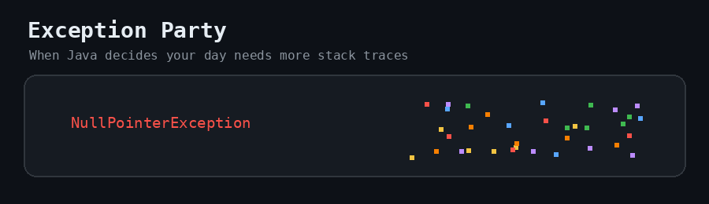
      <br />
      <strong>Exception Party</strong>
    </td>
  </tr>
</table>

## More Developer Moments

<table>
  <tr>
    <td align="center">
      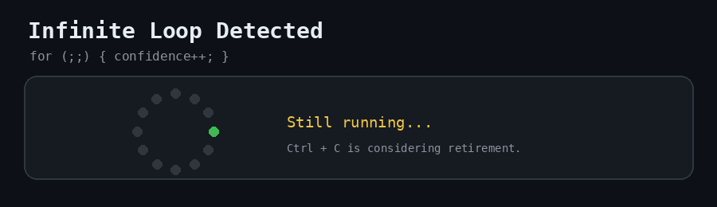
      <br />
      <strong>Infinite Loop</strong>
    </td>
    <td align="center">
      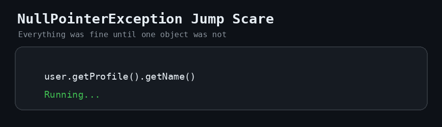
      <br />
      <strong>Null Pointer Jump Scare</strong>
    </td>
  </tr>
  <tr>
    <td align="center">
      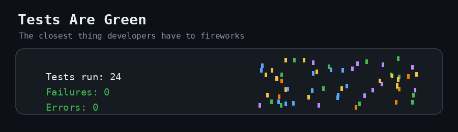
      <br />
      <strong>Tests Are Green</strong>
    </td>
    <td align="center">
      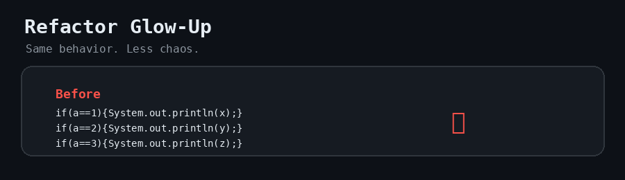
      <br />
      <strong>Refactor Glow-Up</strong>
    </td>
  </tr>
  <tr>
    <td align="center">
      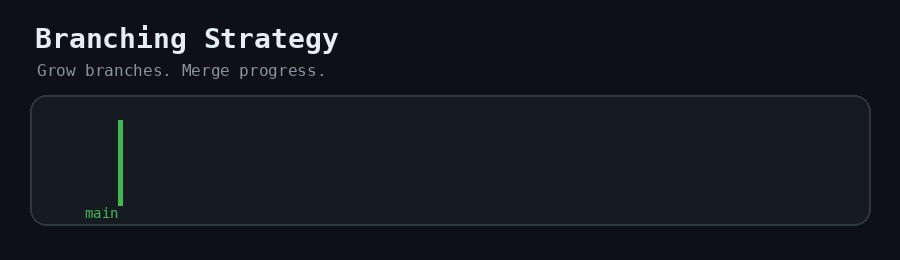
      <br />
      <strong>Branch Tree</strong>
    </td>
    <td align="center">
      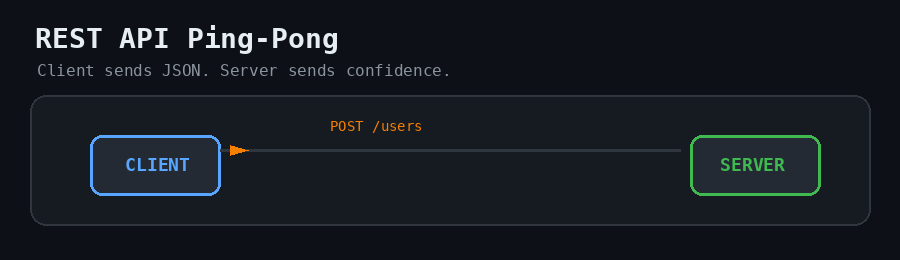
      <br />
      <strong>REST API Ping-Pong</strong>
    </td>
  </tr>
  <tr>
    <td align="center">
      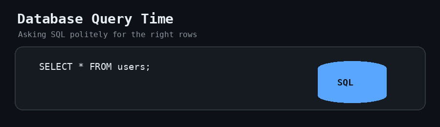
      <br />
      <strong>Database Query</strong>
    </td>
    <td align="center">
      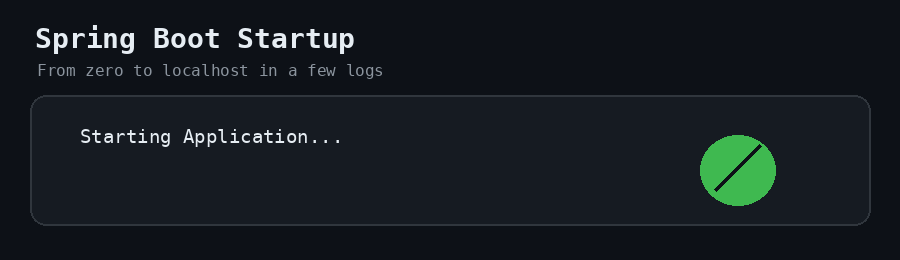
      <br />
      <strong>Spring Boot Startup</strong>
    </td>
  </tr>
  <tr>
    <td align="center">
      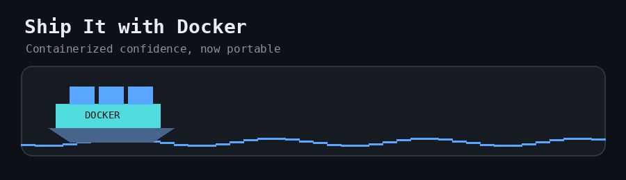
      <br />
      <strong>Docker: Ship It</strong>
    </td>
    <td align="center">
      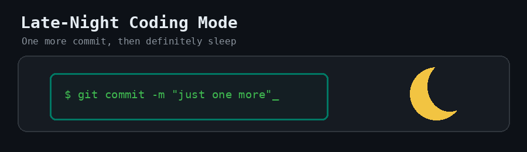
      <br />
      <strong>Late-Night Coding</strong>
    </td>
  </tr>
</table>

## Documentation

- [Java Backend Roadmap](ROADMAP.md)
- [Learning Log](LEARNING_LOG.md)

## Technology Stack

- Java 25
- Maven
- IntelliJ IDEA
- Git
- GitHub
- GitHub Actions

## Repository

[github.com/himanshuParashar0101/java-backend-learning-journey](https://github.com/himanshuParashar0101/java-backend-learning-journey)

## Author

**Himanshu Parashar**

Learning Java and backend engineering through structured practice, documentation, testing, and professional Git workflows.